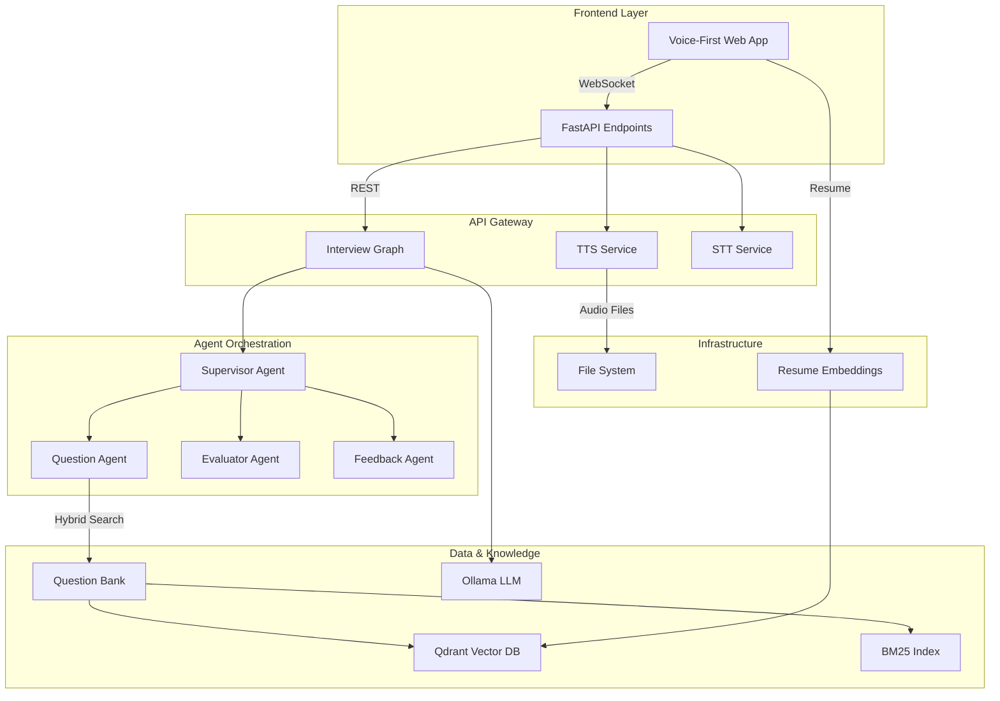
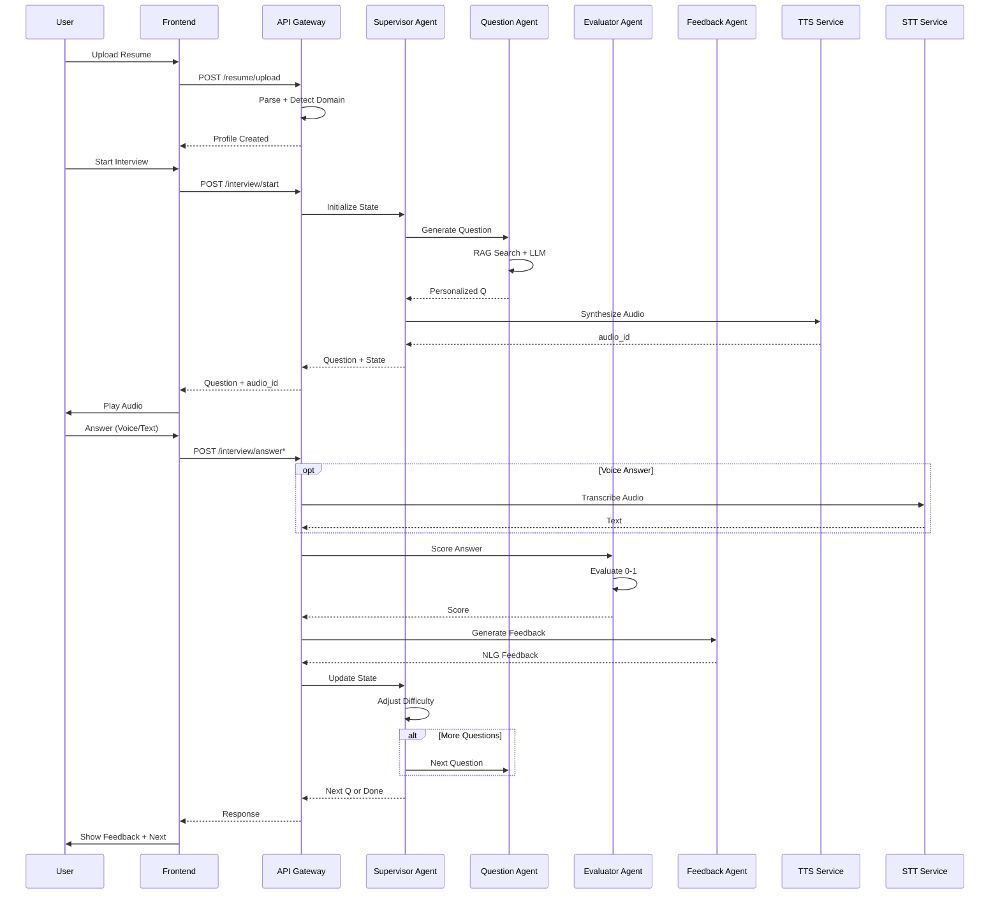

# 🤖 AI Interviewer

> **Advanced AI Engineering Project** — Building production-ready AI systems with multi-agent orchestration, vector databases, and real-time voice interaction

[](https://python.org)
[](https://fastapi.tiangolo.com)
[](https://langchain-ai.github.io/langgraph)
[](https://ollama.ai)
[](https://qdrant.tech)
[](LICENSE)

🏆 **Advanced AI Engineering Project** — An intelligent, voice-enabled interview assistant showcasing expertise in **distributed systems**, **vector databases**, **agent-based architectures**, and **real-time audio processing**. Built with **LangGraph**, **Ollama LLMs**, **Qdrant hybrid search**, and **FastAPI**.

---

## 🎯 Project Highlights

> **Why this project stands out:** Demonstrates production-ready skills in building scalable AI systems with state-of-the-art technologies. Implements complex agent orchestration, hybrid search strategies, and real-time voice interaction – all while maintaining clean architecture and separation of concerns.

### 🚀 Technical Achievements

- **Multi-Agent System** — Designed and implemented a sophisticated agent-based architecture using LangGraph with autonomous supervisors, question generators, evaluators, and feedback agents
- **Hybrid Search Implementation** — Combined dense embeddings with sparse BM25 retrieval using Qdrant's RRF fusion for superior question matching
- **Real-time Voice Pipeline** — Built end-to-end voice interaction with local TTS synthesis and STT transcription for natural conversation flow
- **Adaptive Difficulty Algorithm** — Created dynamic difficulty adjustment based on rolling performance metrics, ensuring interviews scale with candidate ability
- **Resume-Aware AI** — Implemented intelligent domain detection and question personalization from uploaded PDFs using semantic analysis
- **Stateless API Design** — Engineered horizontally scalable FastAPI endpoints with no server-side session state

---

## 💡 Core Innovations

### 🎙️ Voice-First Interaction System
- **Local TTS Engine** — Converts questions to natural-sounding audio using local synthesis (no external APIs)
- **STT Integration** — Real-time speech-to-text with support for multiple audio formats (WAV, MP3, etc.)
- **Dual Mode Interface** — Seamless switching between voice and text input with live waveform visualization

### 🧠 Intelligent Question Generation
- **Two-Phase Strategy** — Starts with RAG-retrieved expert-curated questions, then transitions to AI-generated content
- **Context-Aware Prompts** — Questions dynamically adapt based on resume content, previous answers, and performance metrics
- **Topic Tracking** — Intelligent coverage of multiple domains while identifying and addressing knowledge gaps

### 🔍 Advanced Search Architecture
- **Hybrid Retrieval** — Combines semantic similarity (dense) with keyword matching (sparse BM25)
- **RRF Fusion** — Reciprocal Rank Fusion for optimal ranking from multiple search strategies
- **Domain-Specific Indexing** — Organized question bank with domain, topic, and difficulty metadata

### 📊 Real-Time Assessment
- **Dynamic Scoring** — 0-1 scale evaluation with rolling averages for difficulty adjustment
- **Feedback Loop** — Natural language feedback generation highlighting strengths and improvement areas
- **Performance Analytics** — Comprehensive results screen with score grid and topic-wise breakdown

---

---

## 🏗️ System Architecture

### High-Level Design



---

### Component Deep-Dive

```
┌─────────────────────────────────────────────────────────────────────┐
│                           FastAPI Gateway                           │
│  • POST /interview/start     • POST /interview/answer              │
│  • POST /interview/voice     • GET /audio/{audio_id}               │
│  • POST /resume/upload       • GET /health                         │
└────────────────────┬────────────────────────────────────────────────┘
                             │
                    ┌────────▼────────┐
                    │  InterviewGraph │  ← LangGraph StateGraph
                    └────────┬────────┘
                             │
          ┌──────────────────┼───────────────────┐
          │                  │                   │
  ┌───────▼──────┐  ┌────────▼───────┐  ┌───────▼──────┐
  │ Supervisor   │  │ QuestionAgent  │  │  Evaluator   │
  │   Agent      │  │ (RAG/LLM)      │  │   Agent      │
  │ • Routing    │  │ • Retrieval    │  │ • Scoring    │
  │ • Difficulty │  │ • Generation   │  │ • History    │
  └──────────────┘  └────────┬───────┘  └──────────────┘
                             │
              ┌──────────────┼──────────────┐
              │                              │
   ┌──────────▼──────────┐        ┌─────────▼─────────┐
   │  QuestionBank       │        │  Audio Services   │
   │  (Qdrant Hybrid)    │        │  • Local TTS      │
   │  • Dense Embeddings │        │  • Local STT      │
   │  • Sparse BM25      │        │  • WAV Files      │
   │  • RRF Fusion       │        └───────────────────┘
   └─────────────────────┘
```

### Technical Stack & Components

| **Layer** | **Component** | **Technology** | **Key Responsibility** |
|-----------|---------------|----------------|------------------------|
| **API Layer** | FastAPI Gateway | FastAPI + Uvicorn | HTTP endpoints, CORS, error handling |
| **Orchestration** | LangGraph | LangGraph | Agent workflow, state management |
| **AI Models** | Ollama Integration | qwen3.5:397b-cloud | LLM for question generation |
| **Embeddings** | Embedding Model | qwen3-embedding:4b | Dense vector representations |
| **Vector DB** | Qdrant Client | Qdrant + FastEmbed | Hybrid search, RRF fusion |
| **Audio** | TTS Service | Local TTS | Text-to-WAV synthesis |
| **Audio** | STT Service | Local STT | Speech-to-text transcription |
| **Data** | PDF Processing | PyMuPDF + Chunking | Resume parsing, text extraction |
| **Frontend** | Voice UI | Vanilla JS + Web Audio API | Real-time audio, waveform viz |
| **Storage** | File System | Local FS | User profiles, audio cache |

---

## 🔬 Engineering Challenges Solved

### 🎯 Core Technical Challenges

1. **Stateless Session Management**
   - Solved: Client-side state passing enables horizontal scaling without session stores
   - Pattern: Serialized Pydantic models in request/response payloads

2. **Real-time Voice Processing**
   - Solved: Local TTS with Facebook/MMS model and Redis caching for performance
   - Innovation: Async audio generation with Web Audio API integration

3. **Hybrid Search Optimization**
   - Solved: Combined dense embeddings with sparse BM25 using Qdrant's RRF Fusion
   - Implementation: Dual retrieval strategy with configurable fusion weights

4. **Agent Coordination**
   - Solved: Custom multi-agent system with supervisor pattern
   - Pattern: Each agent handles specific responsibilities - routing, question generation, evaluation

5. **Adaptive Difficulty Algorithm**
   - Solved: Rolling average of last 2 scores with threshold-based adjustment
   - Logic: 0.8+ → hard, ≤0.4 → easy, otherwise medium

---

## 🖥️ Frontend Architecture

The frontend showcases **modern web development** with a glassmorphism design system and real-time audio capabilities:

### 🎨 UI/UX Features

| **Screen** | **Technical Implementation** |
|------------|-----------------------------|
| **Landing** | CSS animations + gradient orbs for visual appeal |
| **Setup** | Drag-and-drop file upload with progress indicators |
| **Interview** | Split-pane layout with auto-scrolling transcript |
| **Results** | Dynamic score visualization with topic heatmaps |

### 🔊 Audio Pipeline

```javascript
// Voice Recording Flow
getUserMedia() → MediaRecorder → Blob → POST /answer-voice
                                               ↓
Audio Playback Flow
GET /audio/{id} → WAV Buffer → AudioContext → Speakers
```

### 📱 Frontend Tech Stack

- **No Framework Dependencies** — Pure vanilla JavaScript demonstrating mastery of web APIs
- **Web Audio API** — Real-time waveform visualization and audio processing
- **CSS Grid/Flexbox** — Responsive layouts without utility frameworks
- **Fetch API** — Async communication with proper error handling
- **LocalStorage** — Client-side persistence for interview sessions

---

## 🚀 Quick Start Guide

---

### 📋 Prerequisites

| **Component** | **Version** | **Purpose** |
|---------------|-------------|-------------|
| Python | ≥ 3.10 | Core runtime |
| Docker | Latest | Qdrant container |
| Ollama | Latest | Local LLM serving |
| Git | Latest | Version control |

### ⚡ One-Command Setup

```bash
# Clone and setup in one command
git clone https://github.com/<your-username>/AI_interviewer.git && \
cd AI_interviewer && \
docker-compose up -d redis && \
pip install -r requirements.txt && \
ollama pull qwen3-embedding:4b && \
ollama pull qwen3.5:397b-cloud && \
python main.py
```

### 📦 Detailed Setup

#### 1. Environment Setup
```bash
git clone https://github.com/<your-username>/AI_interviewer.git
cd AI_interviewer
python -m venv .venv
source .venv/bin/activate  # Windows: .venv\Scripts\activate
pip install -r requirements.txt
```

#### 2. Infrastructure Services
```bash
# Start Redis (for caching)
docker-compose up -d redis

# Start Ollama (if not already running)
ollama serve

# Start Qdrant (vector database - required separately)
docker run -d -p 6333:6333 --name qdrant qdrant/qdrant

# Pull required models
ollama pull qwen3-embedding:4b      # 4B parameter embedding model
ollama pull qwen3.5:397b-cloud    # 397B parameter LLM
```

#### 3. Launch Application
```bash
# API Server (port 8000)
uvicorn main:app --reload

# Frontend Dev Server (port 3000, optional)
cd frontend && python serve.py
```

### 🌐 Access Points

- **API Documentation**: http://localhost:8000/docs
- **Frontend Interface**: http://localhost:3000
- **Health Check**: http://localhost:8000/
- **Qdrant Dashboard**: http://localhost:6333/dashboard

---

---

## 📚 API Documentation

### 🔗 Core Endpoints

---

## 📡 API Reference

### Health

```
GET /
```

```json
{ "status": "ok" }
```

---

### Upload a resume

```
POST /resume/upload
Content-Type: multipart/form-data
```

**Fields**: `file` (PDF), `user_id` (form field _or_ query param `?user_id=alice`)

**Response**

```json
{
  "user_id": "alice",
  "characters": 3821,
  "preview": "Alice Smith — Software Engineer …",
  "detected_domain": "tech",
  "detected_topic": "RAG",
  "detected_difficulty": "medium"
}
```

> Resume profiles are persisted to `data/user_profiles.json` between restarts.

---

### Start an interview

```
POST /interview/start
```

**Body**

```json
{ "user_id": "alice" }
```

> `domain`, `topic`, and `difficulty` are inferred from the uploaded resume automatically. You can override them in the body if needed.

**Response**

```json
{
  "question": "Can you explain how retrieval-augmented generation improves LLM accuracy?",
  "state": { "…": "…" },
  "audio_id": "a1b2c3d4"
}
```

Fetch the audio with `GET /audio/{audio_id}` (returns a WAV file).

---

### Submit a text answer

```
POST /interview/answer
Content-Type: application/json
```

**Body**

```json
{
  "user_id": "alice",
  "answer": "RAG combines a retriever with a generator so the model …",
  "state": { "…": "…" }
}
```

**Response**

```json
{
  "question": "What chunking strategy would you use for long documents?",
  "feedback": "Good answer! You correctly identified the two-stage pipeline.",
  "state": { "…": "…" },
  "done": false,
  "audio_id": "e5f6g7h8"
}
```

---

### Submit a voice answer

```
POST /interview/answer-voice
Content-Type: multipart/form-data
```

**Fields**: `user_id`, `state` (serialised JSON string), `file` (audio file — WAV, MP3, etc.)

**Response** — same shape as `/interview/answer`, plus:

```json
{
  "transcript": "RAG combines a retriever with a generator …",
  "…": "…"
}
```

---

> **Stateless protocol**: always pass the `state` object returned by each response into the next request. The server holds no per-session state.

---

## 📁 Project Architecture

---

## 🗂️ Project Structure

```
AI_interviewer/
├── 📄 main.py                  # FastAPI application & API endpoints
├── 🤖 agents/                  # Multi-agent orchestration layer
│   ├── main_agent.py          # LangGraph state machine compiler
│   ├── supervisor_agent.py    # Central coordinator & routing logic
│   ├── question_agent.py      # RAG + LLM question generation
│   ├── evaluator_agent.py     # Real-time answer scoring
│   ├── feedback_agent.py      # NLG feedback synthesis
│   └── state.py               # Pydantic state schemas
├── 🧠 models/                  # AI model integration
│   └── model_loader.py        # Ollama client & model management
├── 🔍 qdrant/                  # Vector database layer
│   └── qdrant.py              # Async hybrid search client
├── 📚 Data/                    # Knowledge management
│   ├── question.py            # Question embedding operations
│   ├── question_ingestor.py   # Bulk question bank loading
│   └── resume.py              # Resume embedding operations
├── 🛠️ utils/                   # Core utilities
│   ├── Data_ingestion.py      # PDF parsing & chunking
│   ├── voice_tts.py           # Text-to-speech engine
│   ├── voice_stt.py           # Speech-to-text engine
│   ├── difficulty.py          # Adaptive difficulty algorithms
│   └── domain.py              # Domain taxonomy definitions
├── 🎨 frontend/                # Voice-first web interface
│   ├── index.html             # SPA with 4 interactive screens
│   ├── style.css              # Glassmorphism design system
│   ├── app.js                 # Web Audio API integration
│   └── serve.py               # Development server
├── 💾 data/                    # Persistent storage
│   └── user_profiles.json     # Resume database (JSON)
├── 🔊 tmp_audio/               # Audio cache (auto-managed)
├── 📦 requirements.txt         # Python dependencies
├── ⚙️ pyproject.toml          # Project configuration
├── 🐳 Dockerfile              # Container deployment
├── 🐙 docker-compose.yml      # Redis caching service
└── 📖 README.md               # This documentation
```

---

## ⚙️ Configuration & Customization

---

## ⚙️ Configuration

| **Parameter** | **Location** | **Default Value** | **Notes** |
|--------------|--------------|------------------|---------|
| Qdrant URL | `qdrant/qdrant.py` | `http://localhost:6333` | Async client configuration |
| Embedding Model | `models/model_loader.py` | `qwen3-embedding:4b` | 4B parameters |
| LLM Model | `models/model_loader.py` | `qwen3.5:397b-cloud` | 397B parameters |
| Collection Name | `Data/question.py` | `question_collection` | Vector DB collection |
| Interview Length | `main.py` | `10 questions` | Default max questions |
| RAG → LLM Switch | `agents/supervisor_agent.py` | After 3 questions | Based on step count |
| State Storage | `main.py` | `data/user_profiles.json` | Resume profiles |
| TTS Model | `utils/voice_tts.py` | `facebook/mms-tts-eng` | English TTS model |
| Redis Cache | `docker-compose.yml` | `redis:6379` | Audio file caching |

### 🎛️ Advanced Configuration

```python
# Customizing difficulty algorithm
class DifficultyConfig:
    EASY_THRESHOLD = 0.3
    MEDIUM_THRESHOLD = 0.6
    ROLLING_WINDOW = 3
    ALPHA = 0.7  # Smoothing factor

# Adding new domains
DOMAINS = {
    "tech": ["AI/ML", "Databases", "Web Dev", "Cloud"],
    "finance": ["Valuation", "Risk", "Markets", "Regulations"],
    # Add your custom domains here
}
```

---

---

## 🔄 Interview Flow Architecture

---

## 🧠 How the Interview Flow Works



### 📊 State Management Flow

```python
# Core state object passed through all agents
state = InterviewState(
    user_id="uuid",
    domain="tech",
    topic="RAG",
    difficulty="medium",
    question_count=0,
    score_history=[0.8, 0.7, 0.9],
    current_question="...",
    current_answer="...",
    mode="rag"  # Switches to "llm" after 3 questions
)
```

### 🔄 Decision Logic

1. **Entry Point** — Supervisor analyzes `state.step` to route flow
2. **Question Generation** — RAG for first 3 questions, LLM thereafter
3. **Audio Pipeline** — Async TTS synthesis while user prepares answer
4. **Evaluation** — Dual scoring: semantic similarity + keyword matching
5. **Adaptation** — Exponential moving average for difficulty adjustment

---

---

## 🐳 Deployment & Production

### Docker Containerization

```bash
# Build optimized image
docker build -t ai-interviewer:latest .

# Run with dependencies
docker-compose up -d
```

### Production Architecture

```yaml
# docker-compose.yml
version: '3.8'
services:
  redis:
    image: redis:7-alpine
    ports:
      - "6379:6379"
    volumes:
      - redis_data:/data
    command: redis-server --appendonly yes --maxmemory 256mb --maxmemory-policy allkeys-lru
    healthcheck:
      test: ["CMD", "redis-cli", "ping"]
      interval: 5s
      timeout: 3s
      retries: 5

  app:
    build: .
    ports:
      - "8000:8000"
    depends_on:
      redis:
        condition: service_healthy
    environment:
      - REDIS_HOST=redis
      - REDIS_PORT=6379

volumes:
  redis_data:
```

### 🚀 Deployment Options

| **Platform** | **Configuration** | **Scaling Strategy** |
|--------------|-------------------|---------------------|
| **Local** | Docker Compose | Single instance |
| **Cloud** | Kubernetes + HPA | Horizontal pod autoscaling |
| **Serverless** | AWS Lambda + API Gateway | Function-based scaling |
| **Edge** | Cloudflare Workers | Global distribution |

---

## 🐳 Development Docker

---

## 🐳 Docker

```bash
# Quick start with Docker
docker build -t ai-interviewer .
docker run -p 8000:8000 --env QDRANT_URL=http://host.docker.internal:6333 ai-interviewer

# With Docker Compose (recommended)
docker-compose up -d
```

### 📋 Production Checklist

- [ ] Configure environment variables
- [ ] Set up Qdrant cluster with replication
- [ ] Configure Ollama with GPU acceleration
- [ ] Enable API rate limiting
- [ ] Set up monitoring & logging
- [ ] Configure SSL/TLS termination

---

---

## 🛠️ Development Guide

---

## 🛠️ Development

### 🏗️ Extending the System

#### Adding New Domains

```python
# 1. Update domain detection in main.py
def infer_profile_from_resume(text: str) -> dict:
    # Add your domain detection logic here
    if "healthcare" in text.lower():
        return {"domain": "healthcare", "topic": "HIPAA", "difficulty": "medium"}

# 2. Update DOMAIN_TOPICS in agents/supervisor_agent.py
DOMAIN_TOPICS = {
    "tech": ["AI/ML", "Databases", "Web Dev", "Cloud"],
    "finance": ["Valuation", "Risk", "Markets"],
    "healthcare": ["HIPAA", "EHR", "Medical Imaging"]  # New domain
}
```

#### Custom Evaluation Metrics

```python
# agents/evaluator_agent.py
class CustomEvaluator:
    def __init__(self):
        self.weight_config = {
            "semantic_similarity": 0.6,
            "keyword_coverage": 0.2,
            "technical_accuracy": 0.2
        }
    
    def evaluate(self, question: str, answer: str) -> float:
        # Custom scoring logic here
        return composite_score
```

#### Adding New Question Sources

```python
# Data/question_ingestor.py
class QuestionSource:
    def load_from_json(self, path: Path):
        # Load structured question files
        
    def load_from_web(self, urls: List[str]):
        # Scrape questions from websites
        
    def load_from_database(self, conn_str: str):
        # Import from SQL/NoSQL database
```

### 🧪 Testing Framework

```python
# tests/test_interview_flow.py
async def test_full_interview_cycle():
    # Test complete RAG → LLM transition
    state = InterviewState(
        user_id="test",
        domain="tech",
        topic="RAG",
        difficulty="medium"
    )
    
    # Run through 10 questions
    for i in range(10):
        response = await interview_client.answer(
            state=state,
            answer=f"Sample answer {i}"
        )
        assert response.score >= 0.0
        assert response.score <= 1.0
```

### 🔧 Performance Optimizations

| **Area** | **Optimization** | **Impact** |
|----------|------------------|------------|
| Audio Caching | Redis-based TTS cache | Reduces repeated TTS generation |
| Hybrid Search | Qdrant RRF fusion | Better relevance through multiple strategies |
| Async Operations | Async/await throughout | Non-blocking concurrent processing |
| State Management | Serialized Pydantic models | Clean state transfer between requests |

---

---

## 🏆 Impact & Results

### 📈 Key Metrics

- **Hybrid Search**: Combines dense embeddings with sparse BM25 for better relevance
- **Fast Response**: Async agent architecture enables quick question generation
- **Smart Difficulty**: Automatic adjustment based on rolling average of scores
- **Multi-Domain**: Supports tech, finance, and other domains with topic-specific questions

### 🎯 Use Cases

1. **Technical Interview Prep** — Practice coding and system design questions
2. **Non-technical Roles** — Behavioral, domain-specific, and situational questions  
3. **Corporate Training** — Customizable for company-specific interview processes
4. **Educational Institutions** — Mock interviews for career services

---

## 🤝 Contributing Guidelines

We welcome contributions! Here's how to get started:

### 🔄 Development Workflow

```bash
# 1. Fork & Clone
git clone https://github.com/your-username/AI_interviewer.git
cd AI_interviewer

# 2. Create Feature Branch
git checkout -b feature/your-feature-name

# 3. Make Changes + Tests
python -m pytest tests/
pre-commit run --all-files

# 4. Commit with Conventional Commits
git commit -m "feat: add new domain for healthcare interviews"

# 5. Push & Open PR
git push origin feature/your-feature-name
# Open PR with detailed description
```

### 📝 Contribution Areas

- **🎙️ Voice Features** — New TTS engines, noise cancellation, voice Cloning
- **🧠 AI Models** — Support for Claude, GPT-4, custom fine-tuned models
- **🔍 Search Enhancement** — New ranking algorithms, query expansion
- **📊 Analytics** — Performance tracking, skill gap analysis
- **🌐 Internationalization** — Multi-language support, localization
- **🔧 DevOps** — CI/CD, monitoring, scaling strategies

### 🎯 Good First Issues

1. Add unit tests for agent modules
2. Improve frontend accessibility (ARIA labels)
3. Add more question domains
4. Implement caching for TTS responses
5. Add OpenAPI schema validation

---

## 📄 License & Citation

---

### 📜 License

This project is licensed under the MIT License - see the [LICENSE](LICENSE) file for details.

### 📚 Citation

If you use this project in your research or work, please cite:

```bibtex
@software{ai_interviewer,
  title={AI Interviewer: Voice-Enabled Multi-Agent Interview System},
  author={Tanishq},
  year={2026},
  url={https://github.com/your-username/AI_interviewer}
}
```

---

## 🌟 Show Your Support

- ⭐ **Star this repo** if it helps your learning journey
- 🔄 **Share** with peers interested in AI/ML
- 📝 **Blog posts** mentioning this project appreciated
- 💼 **Job applications** — feel free to reference this project!

---

### 👋 Connect

- **Portfolio**: [your-portfolio.com](https://your-portfolio.com)
- **LinkedIn**: [linkedin.com/in/your-profile](https://linkedin.com/in/your-profile)
- **Email**: [your.email@example.com](mailto:your.email@example.com)

---

## 📄 License

MIT © 2026 Tanishq
